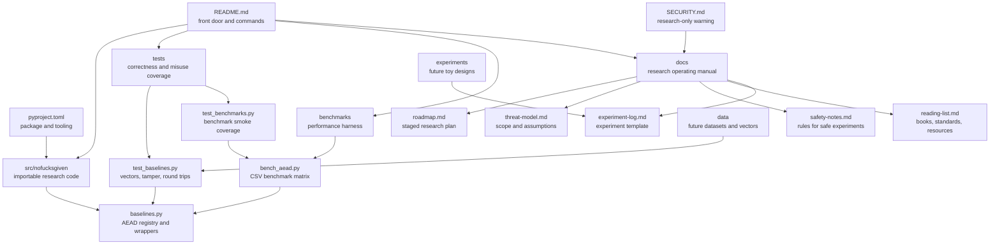

# nofucksgiven

[](#status)
[](pyproject.toml)
[](tests/)
[](benchmarks/)

Research workspace for studying symmetric encryption and testing experimental ideas against established authenticated-encryption baselines.

This repo studies AEAD usage, benchmarks, and experiment discipline. It does not propose a replacement cipher.

This is not production cryptography. New constructions remain non-production unless they receive sustained external cryptanalysis, review, and adoption.

## Status

Current baseline layer:

| Area | What exists |
| --- | --- |
| Baselines | AES-GCM-256, ChaCha20-Poly1305 |
| Tests | Property tests, known-answer vectors, tamper checks, input validation, auth-failure checks |
| Benchmarks | CSV-style rows by algorithm, operation, payload size, and throughput |
| Docs | Threat model, roadmap, safety notes, reading list, experiment log |
| Production use | No. Research only. |

## Quickstart

```bash
python -m venv .venv
source .venv/bin/activate
python -m pip install -e ".[dev]"
pytest
```

## Commands

Run these from the repository root after Quickstart.

| Task | Command |
| --- | --- |
| Run tests | `.venv/bin/python -m pytest` |
| Lint | `.venv/bin/ruff check .` |
| Format | `.venv/bin/ruff format .` |
| Benchmark smoke run | `.venv/bin/python benchmarks/bench_aead.py --iterations 10 --sizes 64 1024` |
| Default benchmark matrix | `.venv/bin/python benchmarks/bench_aead.py` |

See [CONTRIBUTING.md](CONTRIBUTING.md) for the local check and experiment workflow.

## Repo Map



For the expanded version, see [docs/repo-map.md](docs/repo-map.md).

## Baseline Example

```python
from nofucksgiven.baselines import AeadCipher

cipher = AeadCipher.new_aes_gcm()
message = b"research sample"
aad = b"context"

sealed = cipher.encrypt(message, aad)
opened = cipher.decrypt(sealed, aad)

assert opened == message
```

## Benchmark Output Shape

Example schema only, not measured results:

```text
algorithm,operation,payload_size,iterations,elapsed_ns,bytes_processed,mib_per_second
aes-gcm-256,encrypt,1024,1000,1234567,1024000,791.02
chacha20-poly1305,decrypt,1024,1000,1234567,1024000,791.02
```

Benchmark numbers are machine-local signals, not security claims.

## Research Flow

1. Study a known primitive or failure mode.
2. Add or import test vectors.
3. Write an isolated experiment under `experiments/`.
4. Compare behavior against `src/nofucksgiven/baselines.py`.
5. Record method, results, and caveats in `docs/experiment-log.md`.
6. Treat every original construction as broken until reviewed.

## Documentation

- [Repo map](docs/repo-map.md)
- [Research roadmap](docs/roadmap.md)
- [Threat model](docs/threat-model.md)
- [Safety notes](docs/safety-notes.md)
- [Reading list](docs/reading-list.md)
- [Experiment log template](docs/experiment-log.md)
- [Contributing](CONTRIBUTING.md)

## License

No open-source license has been selected yet. Until a license is added, reuse rights are not granted by default.
