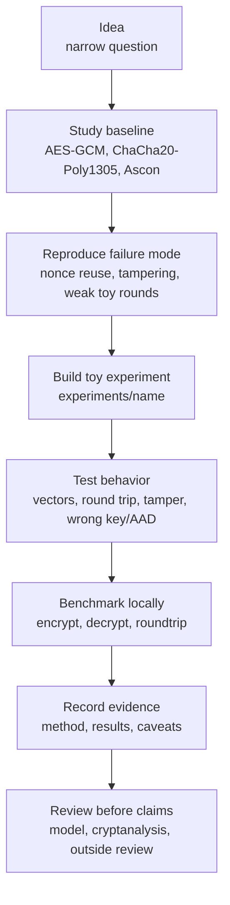

# nofucksgiven

[](#status)
[](pyproject.toml)
[](tests/)
[](benchmarks/)

Use this repo to study symmetric encryption, test ideas against established authenticated-encryption baselines, and keep every claim tied to evidence.

This repo studies AEAD usage, benchmarks, and experiment discipline. It does not propose a replacement cipher.

This is not production cryptography. New constructions remain non-production unless they receive sustained external cryptanalysis, review, and adoption.

## Status

Current baseline layer:

| Area | What exists |
| --- | --- |
| Baselines | AES-GCM-256, ChaCha20-Poly1305 |
| Tests | Property tests, known-answer vectors, tamper checks, input validation, auth-failure checks |
| Benchmarks | CSV-style rows by algorithm, operation, payload size, and throughput |
| Docs | Threat model, roadmap, safety notes, reading list, experiment log |
| Production use | No. Research only. |

## Evidence Leaderboard

This is an evidence-confidence snapshot, not a proof of security. Scores combine public standardization/review signals with local test coverage where we have it.

| Rank | Algorithm | Evidence Score | Status | Local Experiments | Main Caution |
| ---: | --- | ---: | --- | --- | --- |
| 1 | AES-GCM-256 | 94 | recommended_baseline | vectors, properties, tamper tests, benchmarks | Nonce reuse with the same key is catastrophic |
| 2 | AES-GCM-SIV | 91 | recommended_misuse_resistant | none yet | Not implemented in the local baseline wrapper |
| 3 | ChaCha20-Poly1305 | 88 | recommended_baseline | vectors, properties, tamper tests, benchmarks | Nonce reuse with the same key is unsafe |
| 4 | Ascon-AEAD128 | 85 | recommended_constrained_devices | none yet | Newer standard than AES and ChaCha20-Poly1305 |
| 5 | XChaCha20-Poly1305 | 83 | recommended_when_available | none yet | Not a NIST standard |

See the full [encryption evidence leaderboard](docs/leaderboard.md), including legacy algorithms and source tags.

## Quickstart

These commands assume Linux/macOS shell paths. On Windows, use the equivalent
virtualenv activation and script paths.

```bash
python -m venv .venv
source .venv/bin/activate
python -m pip install -e ".[dev]"
pytest
```

## Commands

Run these from the repository root after Quickstart.

| Task | Command |
| --- | --- |
| Run tests | `.venv/bin/python -m pytest` |
| Lint | `.venv/bin/ruff check .` |
| Format | `.venv/bin/ruff format .` |
| Standard check | `make check` |
| Render leaderboard | `make leaderboard` |
| Benchmark smoke run | `.venv/bin/python benchmarks/bench_aead.py --iterations 10 --sizes 64 1024` |
| Default benchmark matrix | `.venv/bin/python benchmarks/bench_aead.py` |
| Install git hooks | `scripts/install-hooks.sh` |

See [CONTRIBUTING.md](CONTRIBUTING.md) for the local check and experiment workflow.

## Development Map



For the expanded version, see [docs/development-map.md](docs/development-map.md).

## Baseline Example

```python
from nofucksgiven.baselines import AeadCipher

cipher = AeadCipher.new_aes_gcm()
message = b"research sample"
aad = b"context"

sealed = cipher.encrypt(message, aad)
opened = cipher.decrypt(sealed, aad)

assert opened == message
```

## Benchmark Output Shape

Example schema only, not measured results:

```text
algorithm,operation,payload_size,iterations,elapsed_ns,bytes_processed,mib_per_second
aes-gcm-256,encrypt,1024,1000,1234567,1024000,791.02
chacha20-poly1305,decrypt,1024,1000,1234567,1024000,791.02
```

Benchmark numbers are machine-local signals, not security claims.

## Research Flow

1. You start with a narrow question.
2. You study the known primitive or failure mode first.
3. You add or import test vectors.
4. You write an isolated experiment under `experiments/`.
5. You compare behavior against `src/nofucksgiven/baselines.py`.
6. You record method, results, and caveats in `docs/experiment-log.md`.
7. We treat every original construction as broken until reviewed.

## Documentation

- [Development map](docs/development-map.md)
- [Encryption evidence leaderboard](docs/leaderboard.md)
- [Research roadmap](docs/roadmap.md)
- [Threat model](docs/threat-model.md)
- [Safety notes](docs/safety-notes.md)
- [Reading list](docs/reading-list.md)
- [Experiment log template](docs/experiment-log.md)
- [Codex workflow](docs/codex-workflow.md)
- [Commands](docs/commands.md)
- [Contributing](CONTRIBUTING.md)

## License

Apache-2.0. See [LICENSE](LICENSE).

The license covers reuse terms. It does not make experimental cryptography safe for real data.
