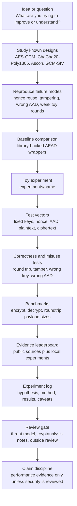

# Development Map

Use this map to understand what we are building and how you should move an idea from research into repeatable evidence.

## Flow



## How You Use It

Start with a narrow question. Do not begin with “build a better cipher.” Begin with something you can test:

- What happens when a nonce is reused?
- How does a baseline behave under tampering?
- Can a toy construction survive a simple attack?
- What changes performance on this machine?
- What does a safer API prevent the caller from doing?

Then move through the flow:

1. Study the known design you are comparing against.
2. Reproduce at least one failure mode so you understand what can go wrong.
3. Add or import fixed vectors.
4. Write tests that break when behavior changes.
5. Run benchmarks only after correctness and rejection tests pass.
6. Record what happened, what it means, and what it does not prove.

## Where Work Goes

Use this shape for new algorithm experiments:

```text
experiments/<experiment-name>/
├── README.md              # what you are testing and why
├── vectors.json           # fixed test vectors, if applicable
├── prototype.py           # toy or experimental code only
└── results.md             # benchmark and analysis notes
```

Keep production-facing wrappers in `src/nofucksgiven/` limited to library-backed baselines unless we deliberately decide to promote a research helper. Keep experimental designs under `experiments/`.

## Evidence Gates

Before you make a performance statement, include real environment data:

- CPU and OS.
- Python and dependency versions.
- Algorithm, operation, payload size, and iterations.
- Date and command used.
- A caveat that benchmark numbers are local evidence.

Before you make a security statement, stop. Local tests and repo docs are not
enough. You need a written security model, public cryptanalysis, implementation
review, and outside review beyond this repository.
