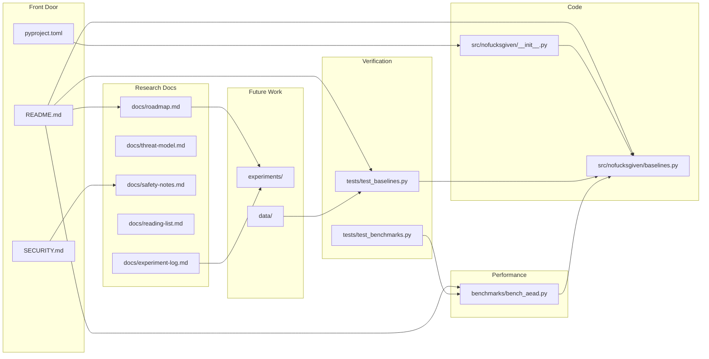

# Repo Map

This project is set up as a research workspace, not a production encryption library. The core idea is to keep library-backed AEAD baselines, tests, benchmarks, and experiment notes separate so future algorithm work has a clean place to land.

## Visual Map



## File Responsibilities

| Path | Purpose |
| --- | --- |
| [README.md](../README.md) | First screen on GitHub: status, quickstart, commands, repo map, documentation links. |
| [CONTRIBUTING.md](../CONTRIBUTING.md) | Local checks, experiment rules, and commit guidance. |
| [SECURITY.md](../SECURITY.md) | Makes the safety boundary explicit: research only, not production crypto. |
| [pyproject.toml](../pyproject.toml) | Python package metadata and dev tooling config. |
| [src/nofucksgiven/baselines.py](../src/nofucksgiven/baselines.py) | Library-backed AEAD wrappers, algorithm names, and algorithm metadata. |
| [tests/test_baselines.py](../tests/test_baselines.py) | Known-answer vectors, property tests, and misuse/tamper rejection. |
| [tests/test_benchmarks.py](../tests/test_benchmarks.py) | Smoke tests for benchmark structure. |
| [benchmarks/bench_aead.py](../benchmarks/bench_aead.py) | Local benchmark matrix for AEAD algorithms and operations. |
| [docs/roadmap.md](roadmap.md) | Staged path from foundations to publishable research. |
| [docs/threat-model.md](threat-model.md) | Current scope, assumptions, and out-of-scope areas. |
| [docs/safety-notes.md](safety-notes.md) | Rules for keeping experiments honest and non-production. |
| [docs/reading-list.md](reading-list.md) | Books, standards, and testing resources. |
| [docs/experiment-log.md](experiment-log.md) | Template for recording hypotheses, methods, results, and caveats. |
| `experiments/` | Future toy designs and controlled experiments. |
| `data/` | Future datasets, generated vectors, and benchmark inputs. |

## Where New Algorithm Work Goes

Use this path for future research work:

```text
experiments/<experiment-name>/
├── README.md              # hypothesis, design sketch, safety statement
├── vectors.json           # fixed test vectors, if applicable
├── prototype.py           # toy or experimental code only
└── results.md             # benchmark and analysis notes
```

Then add focused tests under `tests/` and compare performance against the AEAD baselines. Make no security claim without a written model, cryptanalysis, and independent review.
